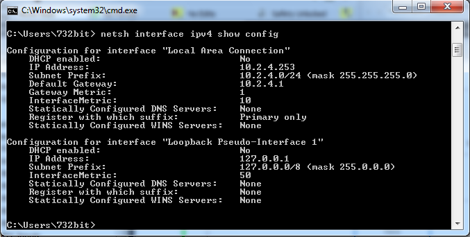

# Batch-Files-for-Changing-IP-Address
### Easy shortcut for switching your computer back and forth between a static IP address and DHCP in Windows.

When it becomes tiresome to change your computer's IPv4 address by navigating through Control Panel, these .bat files can provide a quick shortcut.  I created them because I sometimes find myself having to switch between a static IP address and DHCP numerous times a day.  The files titled "Change IP Address to DHCP.bat" and "Change IP Address to Static.bat" are templates that you can adapt to your specific needs.

### Step 1: Save the two files "Change IP Address to DHCP.bat" and "Change IP Address to Static.bat" on your computer.

### Step 2: Determine Which Network Connection You Want to Change.
In command prompt, type `netsh interface ipv4 show config`.  You will see the various ethernet connections available on your computer.  Select which one you will need to change the IP address of.  In this example it is `"Local Area Connection"`. 



### Step 3: Edit `Change IP Address to DHCP.bat`.
Open this file in a simple text editor such as Notepad.  Here is what you will see:
```
@echo off
echo Changing IP Address to DHCP
netsh interface ipv4 set address name="Local Area Connection" source=dhcp
netsh int ip show config
echo Change complete
timeout 4
```
Replace `Local Area Connection` with the name of your target ethernet connection found in step 1.  Keep the quotation marks.  Save the file.

### Step 4: Edit `Change IP Address to Static.bat`.
Open this file in a text editor.  Here is what you will see:
```
@echo off
echo Changing IP Address to 10.2.4.253
netsh interface ipv4 set address name="Local Area Connection" static 10.2.4.253 255.255.255.0 10.2.4.1
netsh int ip show config
echo Change complete
timeout 4
```
Similarly to Step 3, replace `Local Area Connection` with the name of your target ethernet connection, while keeping the quotation marks.  Decide what static IP address you want to use, and the gateway.  In the example above, I have chosen `10.2.4.253` to become the computer's IP address, but you should replace that with the address you want.  There are two places to change it - on the second line which is just a printed output to the command prompt, and on the third line where the command to change the address is.  On the third line, the IP address is followed by the subnet mask (`255.255.255.0` in the example) and the default gateway (`10.2.4.1` in the example).  Replace the subnet mask and/or gateway as appropriate for your needs.  Save the file.

### Step 5: Create Shortcuts with Admin Privileges
You will need to run these .bat files as an Administrator.  Instead of having to right click on them and "Run as administrator", you can create shortcuts with admin privileges and just open those shortcuts.  To do so, first right click on each of the files in Windows File Explorer and click "Create shortcut".  Now right click on each of the shortcuts and click "Properties".  In the "Shortcut" tab, click the "Advanced.." button.  Check the box that says "Run as administrator".  Now put the shortcuts wherever you want them for quick access.


### Step 6: Test it out.
As with anything, make sure it works as expected.


